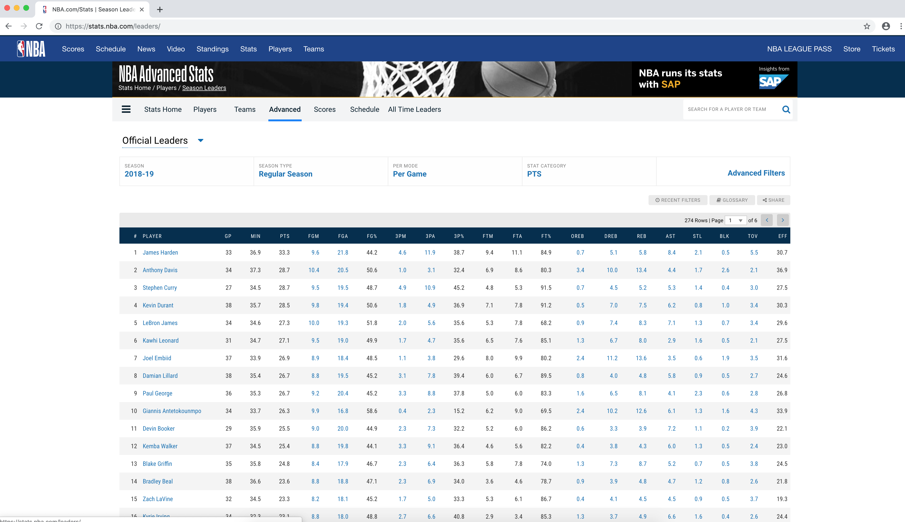
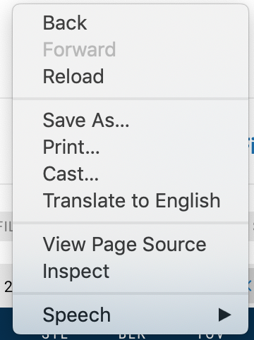
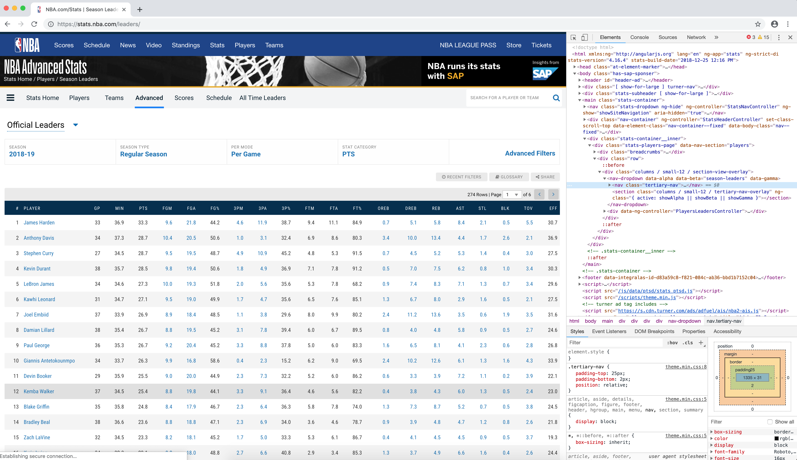
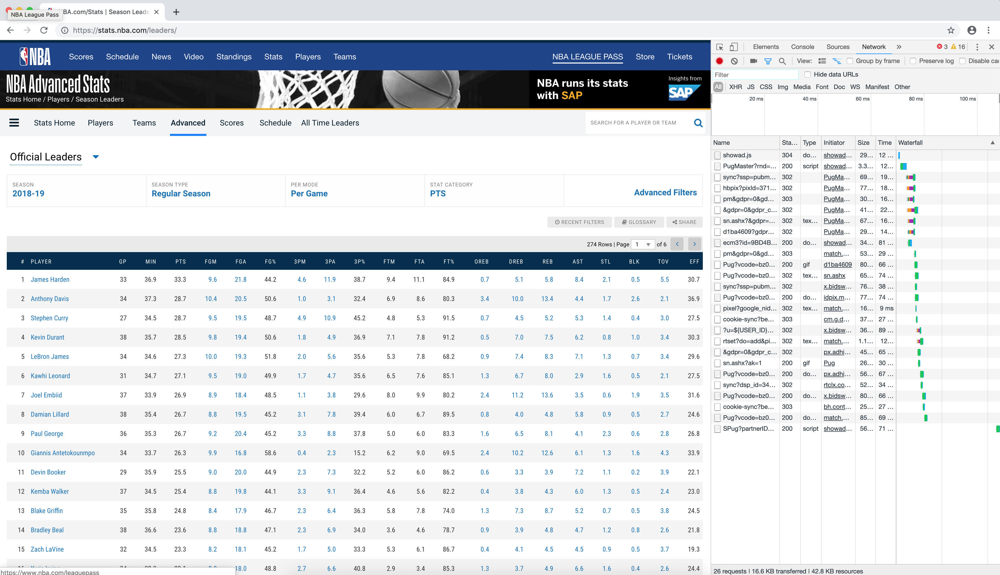
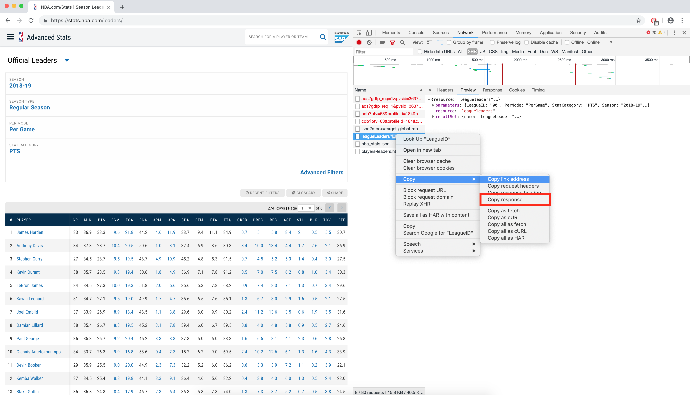
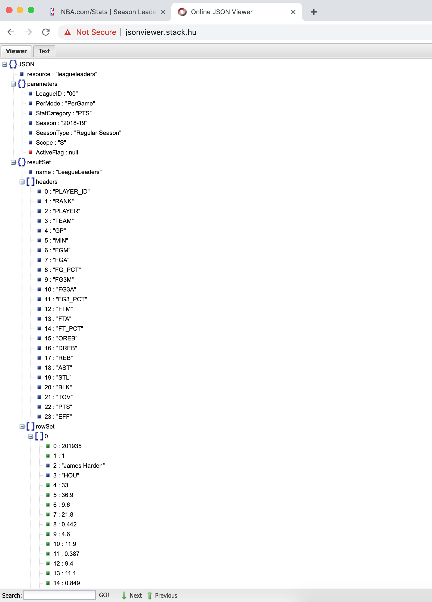

## Finding endpoints from pages on Stats(dot)NBA(dot)com

In this tutorial I will show you how to use google chrome's developer tools
to get the information necessary to scrape data from stats.nba.com.

This tutorial will be broken into 2 parts:
1. Getting the endpoint from the page
2. Calling the endpoint and saving the data

### 0.1 Notes
The method presented here works for stats.nba.com, and may work for other data sources, but it will not work for all sources.
It will only work for javascript based pages that fill their data dynamically from external APIs. Any site that uses
dynamically generated pages through the use of a web framework such as Rails or Django will need to be scraped using a scraping library
such as BeautifulSoup4

### 0.2 Requirements
This tutorial uses the latest version of Google Chrome for finding the endpoint information.
The code in this tutorial was written in python 3.7 and uses the following libraries:
1. Pandas 0.23.4
2. urllib 1.24.1


### 1. Finding the endpoint information

For this tutorial I will be downloading the per game stats of every player in the league
in a single season which can be found on https://stats.nba.com/leaders/

The first step is to open google chrome and navigate to the page we want to gather the data from.



Once on the page open the Chrome Developer Tools. To do this
right click the page and select inspect



That should open a panel on the right side of the screen like shown.
Next click on the network tab in order to see all api calls made by the page.



Once on the Network tab, select XHR and reload the page. Once the page has loaded you will need
to look through he different calls to the find the one you want. It will normally
be called something similar to the name the page you are on and will be followed by a bunch of query parameters.



On you have found the correct API call (or if you are still trying to find the exact one you want) you can right click the call and copy the response.



You can then paste the response into a json viewer such as http://jsonviewer.stack.hu/ to get a better look as the response of the call.



Once you are sure you have the right API call you can copy the request.


Now that you have the API request you can start calling the API as we show in Part 2


### 2. Getting data from stats.nba.com

#### Source Code

[Source Code](download_stats_nba_data.py)

For this we will be getting single season totals for all players who played in a single season using the endpoint `leaguedashplayerstats`.
The necessary params for this call can be found here: http://nbasense.com/nba-api/Stats/Stats/Players/PlayersGeneralStats

The code for this process is very simple:
First we need to import the necessary libraries. We need json for parsing the
response from the nba api, pandas for building our dataframe and urllib3 for making calls to the nba api.
```
import json
import pandas as pd
import urllib3
```

We now need to instantiate a client and choose a season
```
client = urllib3.PoolManager()
season = "2018-19"
```

Then we need to build our dataframe We do this by calling the endpoint described above and parsing the json into our dataframe.
Luckily the stats.nba api returns objects that can easily be converted into a dataframe, with a single field of headers and then an array of arrays
```
frame = extract_data(client, player_stats_url(season))

# Extract json
def extract_data(http_client, url):
    r = http_client.request('GET', url, headers=header_data)      # Call the GET endpoint
    resp = json.loads(r.data)                                     # Convert the response to a json object
    results = resp['resultSets'][0]                               # Take the first item in the resultsSet (This can be determined by inspection of the json response)
    headers = results['headers']                                  # Take the headers of the response (our column names)
    rows = results['rowSet']                                      # Take the rows of our response
    frame = pd.DataFrame(rows)                                    # Convert the rows to a dataframe
    frame.columns = headers                                       # Set our column names using the  extracted headers
    return frame


```

Here is where we will copy the url we extracted in part 1.
```
# endpoints
def player_stats_url(season):
    return "https://stats.nba.com/stats/leaguedashplayerstats?College=&Conference=&Country=&DateFrom=&DateTo=&Division=&DraftPick=&DraftYear=&GameScope=&GameSegment=&Height=&LastNGames=0&LeagueID=00&Location=&MeasureType=Base&Month=0&OpponentTeamID=0&Outcome=&PORound=0&PaceAdjust=N&PerMode=Totals&Period=0&PlayerExperience=&PlayerPosition=&PlusMinus=N&Rank=N&Season={0}&SeasonSegment=&SeasonType=Regular+Season&ShotClockRange=&StarterBench=&TeamID=0&TwoWay=0&VsConference=&VsDivision=&Weight=".format(
        season)

```

Now we just need to save our dataframe as a csv.
```
frame.to_csv("stats_nba_player_data_{0}.csv".format(season), index=False)
```
