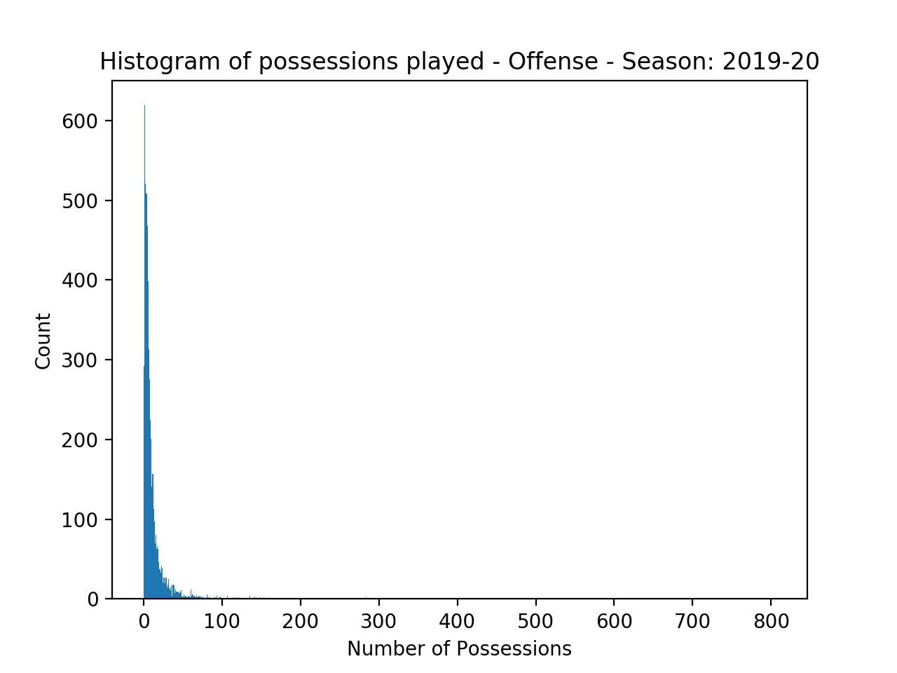
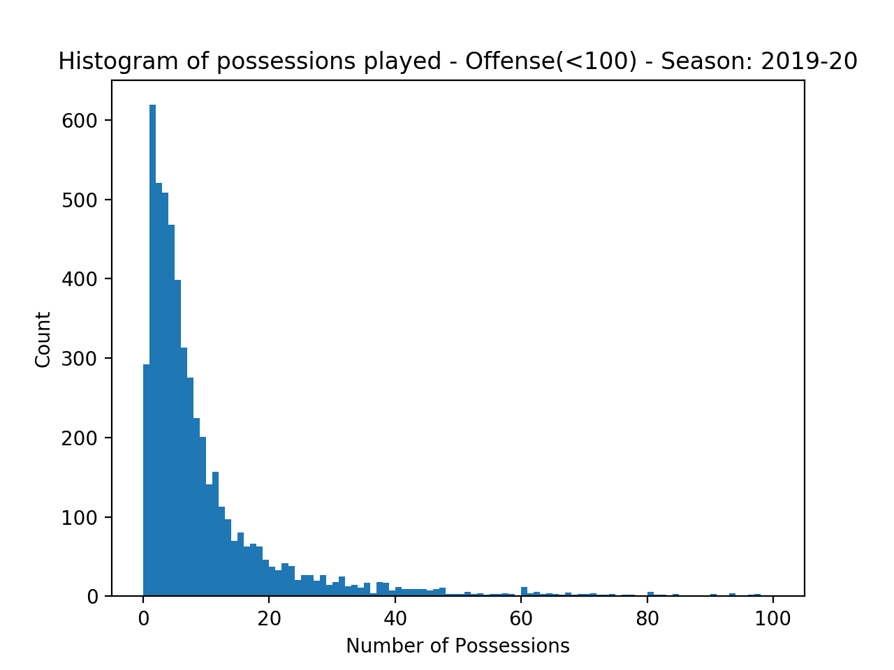
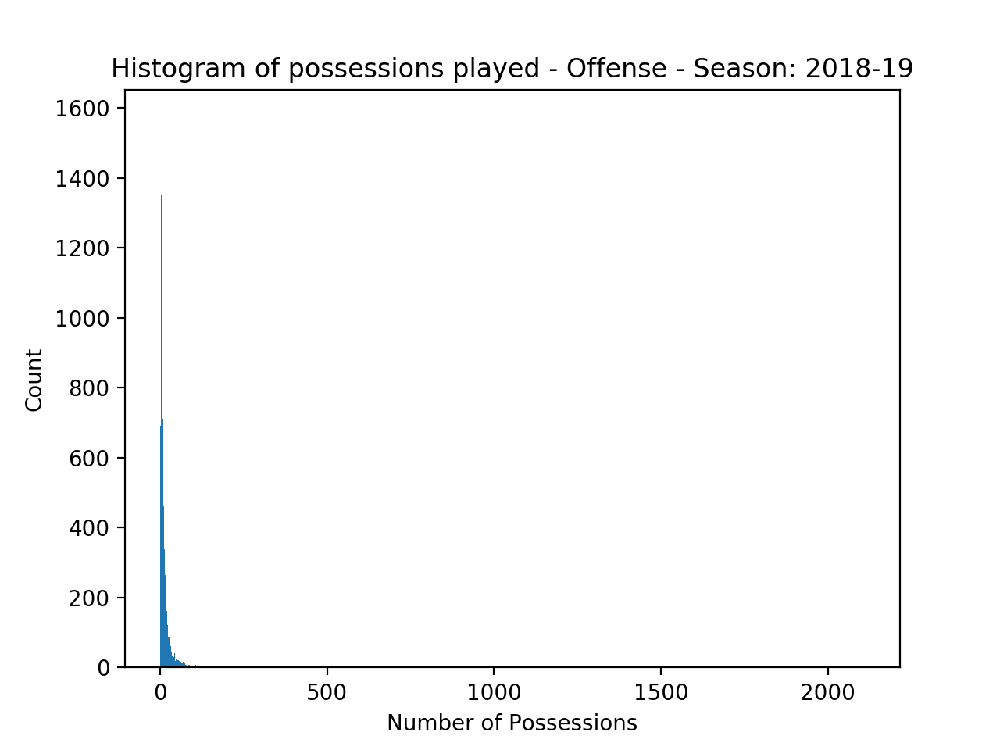
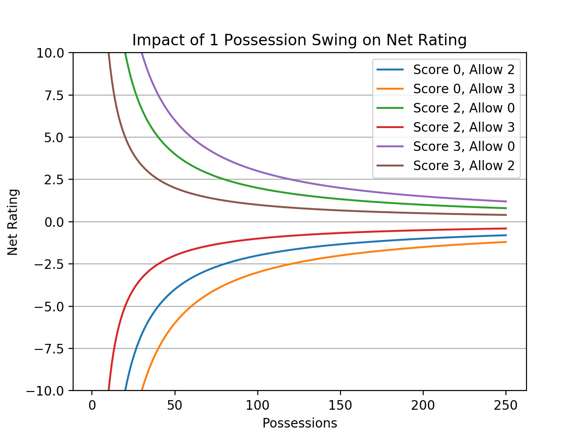

# 5 Man Lineup Net Rating Are Bad

## 5 Man Units are almost all Small Sample

#### 2019-20 (December 10, 2019)
The minimum number of possessions played: 0, the maximum number of possessions played 806.  
82 out of 5440 lineups have played more than 100 possessions together.  
The average number of possessions a lineup has played together is: 12.52.  

The minimum number of possessions faced: 0, the maximum number of possessions faced 809.  
82 out of 5440 lineups have faced more than 100 possessions together.  
The average number of possessions a lineup has faced together is: 12.52.  

#### 2018-19 Full Season
The minimum number of possessions played: 0, the maximum number of possessions played 2110.  
371 out of 15297 lineups have played more than 100 possessions together.  
The average number of possessions a lineup has played together is: 16.92.  

The minimum number of possessions faced: 0, the maximum number of possessions faced 2122.  
371 out of 15297 lineups have faced more than 100 possessions together.  
The average number of possessions a lineup has faced together is: 16.92.  

## Small Sample Means Each Event Can Have Dramatic Impact

##
