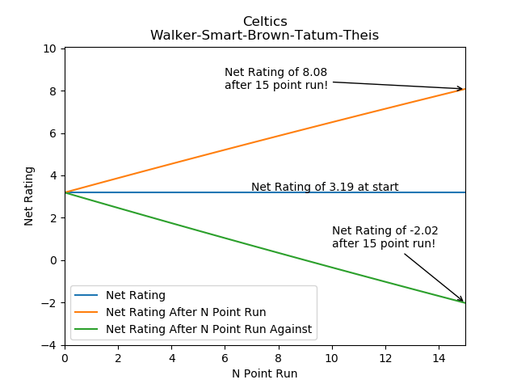
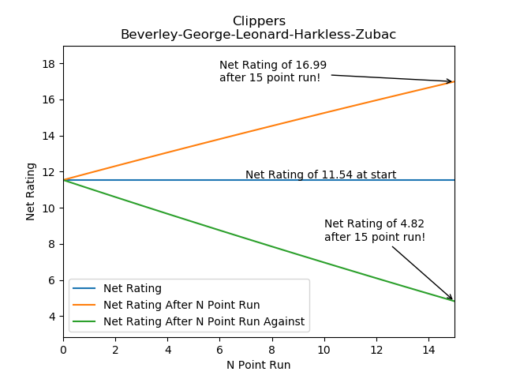
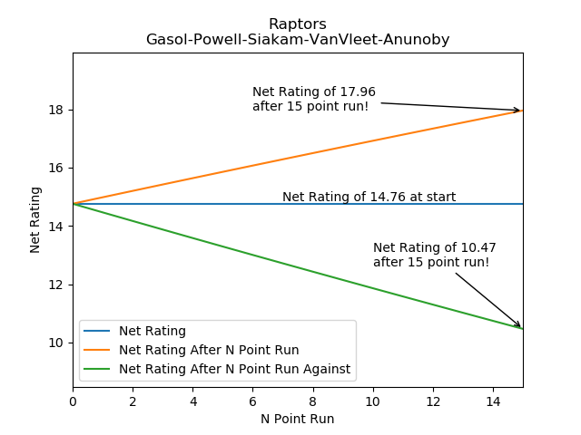

# Five Man Lineup Net Rating Are Bad

I've never really thought about 5 man unit net ratings until this year. I've always heard them brought up by various
talking headers and occasionally a stats person will say they are small sample size theater, but in general they've been
outside my focus. This year I've started to see these numbers pop up as a way to say "See our new starting lineup with
newly acquired players A and B is dominating" or "Wow what a terrible move signing player C, they are dragging down the closing lineup".
The problem with making these judgements is that they are based on something like a 55 possession sample. Using points per 100 possession
on less than 100 possessions is insanity, especially when a single basket changes Net Rating by two to three points at 100 possessions.

## Five Man Units Are Almost All Small Sample

#### 2019-20 (December 10, 2019)
Let's start with the current season. Through December 10th the stats for
the number of offensive and defensive possessions played five man units are shown below.

```
The minimum number of possessions played: 0, the maximum number of possessions played 806
82 out of 5440 lineups have played more than 100 possessions together
3 out of 5440 lineups have played more than 500 possessions together
0 out of 5440 lineups have played more than 1000 possessions together
The average number of possessions a lineup has played together is: 12.52

The minimum number of possessions faced: 0, the maximum number of possessions faced 809
82 out of 5440 lineups have faced more than 100 possessions together
3 out of 5440 lineups have played more than 500 possessions together
0 out of 5440 lineups have played more than 1000 possessions together
The average number of possessions a lineup has faced together is: 12.52
```

This means that the MOST played five man unit in the league at this point has
played about eight games worth of possessions, only 3 lineups have played the equivalent of five games together,
and only 82 lineups have played the equivalent of 1 or more games of
worth of possessions. Below is a histogram of
how many possessions. It's pretty easy to tell that the vast majority
of lineups at this point have less than 20 possessions.


#### 2018-19 Full Season
We know that at ~25 games only a handful of five man units have played
enough possessions so that a single basket doesn't have a large impact
on their net rating. Therefore,  we should look at a full season of data instead.
```
The minimum number of possessions played: 0, the maximum number of possessions played 2110
371 out of 15297 lineups have played more than 100 possessions together
40 out of 15297 lineups have played more than 500 possessions together
15 out of 15297 lineups have played more than 1000 possessions together
The average number of possessions a lineup has played together is: 16.92

The minimum number of possessions faced: 0, the maximum number of possessions faced 2122
371 out of 15297 lineups have faced more than 100 possessions together
40 out of 15297 lineups have played more than 500 possessions together
15 out of 15297 lineups have played more than 1000 possessions together
The average number of possessions a lineup has faced together is: 16.92
```

From the histograms below and from the numbers above, we can see that the distribution is about the same.
We now have 2.5% of all five man units with at least 100 possessions played and the average is up to ~17 possessions.
The most played lineup has about 21 games worth of possessions and it's net rating would no longer be impacted by a large run.
Only 40 lineups have played the equivalent of five games together and only 15 have played the equivalent of 10 games.


Even by the end of a season, we only have a handful of five man units whose net rating we could discuss as any indication of
talent and even then we are only looking at 10 games worth of possessions.
How much can you tell about a team from the net rating after 10 games?

## Small Sample Means Each Event Can Have Dramatic Impact

Now that we know that five Man Units are all pretty much small sample size
theater, let's look at the impact a single offensive and defensive
possession have on net rating.

Let us assume that we have a five man unit that has a league average net rating after N possession.
What would the result of possession N+1 have on the lineups net rating?
Below there is a chart showing the results of this idea. If a 5 man unit
has played 99 offensive and defensive possessions and on offensive
possession 100 they miss a shot and their opponent gets the rebound and then hits a three,
that is a -3 swing in the lineups net rating! From the chart you can see how at low possession counts
a single shot has massive impact on the lineups net rating and even at
250 possessions a single trip up and down the has a noticeable impact.


## Your Favorite Teams Most Played Lineup is a 15 point run away from Glory/Disaster

The last thing I want to leave you with is a chart of how a quick run
could impact the net rating of your favorite teams most played lineup.
In the below charts I have plotted the current Net Rating of the the
lineup and what the net rating would be after each point in a run up to 15 points.
This way you can see what each lineup's net rating would be after going on a 15 point run
or giving up a 15 point run.

### 76ers


### Bucks


### Bulls


### Cavaliers


### Celtics


### Clippers


### Grizzlies


### Hawks


### Heat


### Hornets


### Jazz


### Kings


### Knicks


### Lakers


### Magic


### Mavericks


### Nuggets


### Pelicans


### Raptors


### Rockets


### Spurs


### Suns


### Thunder


### Timberwolves


### Trail Blazers


### Warriors


### Wizards


